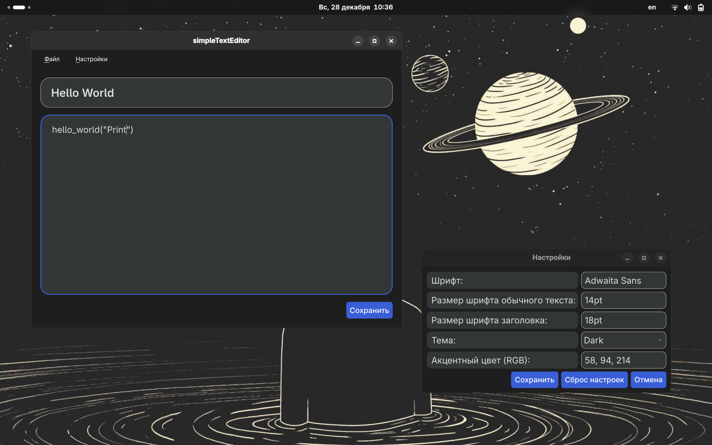
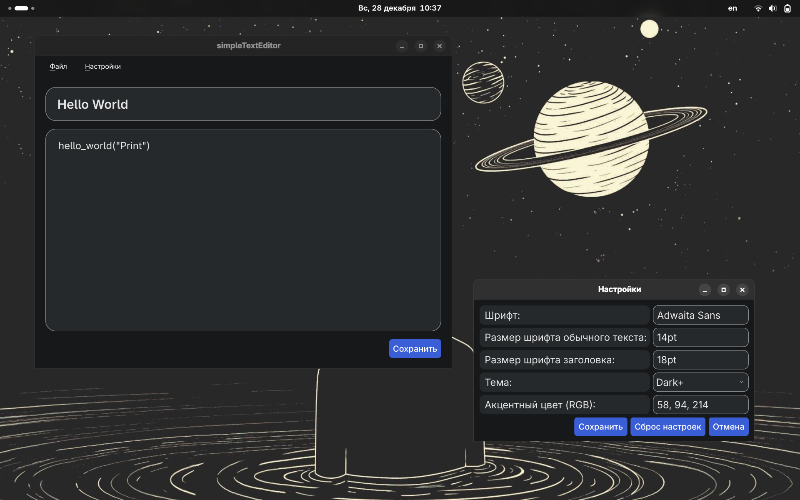
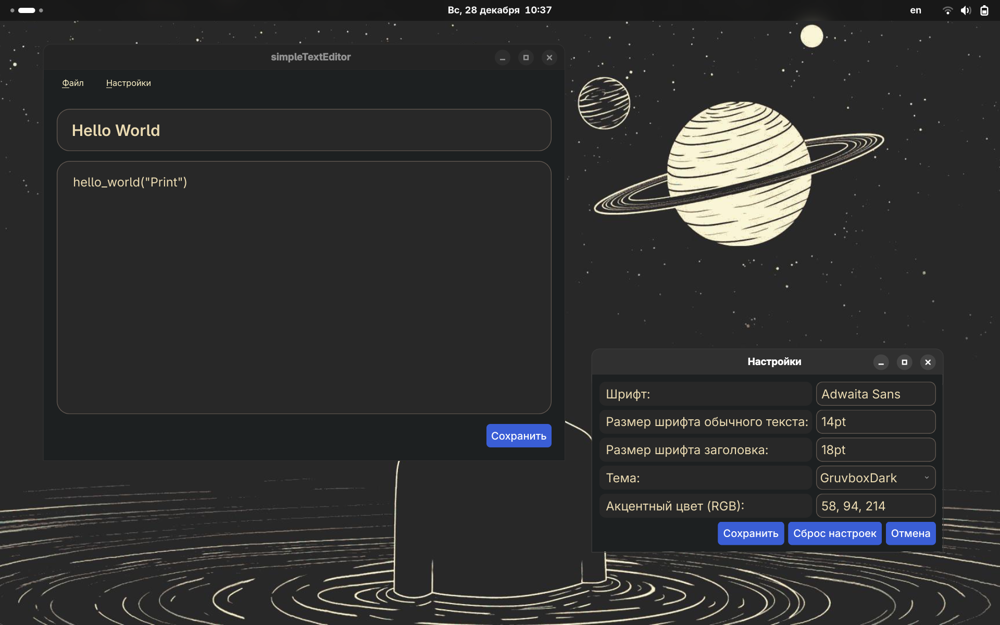
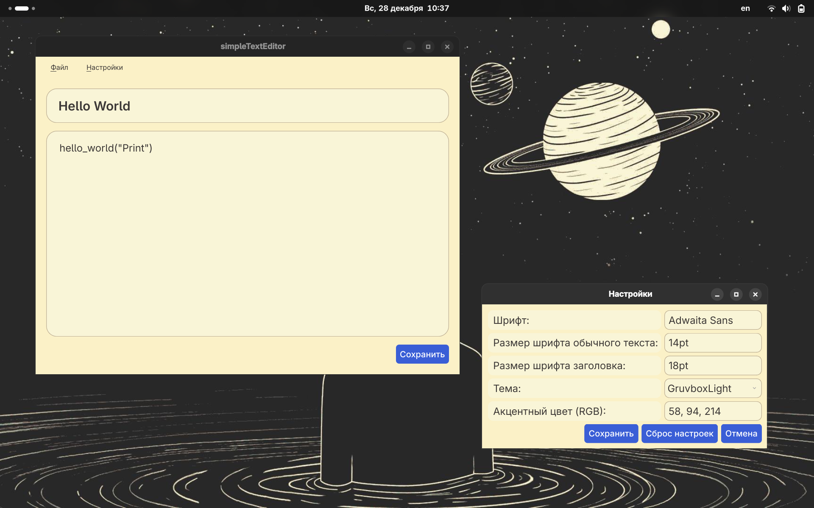
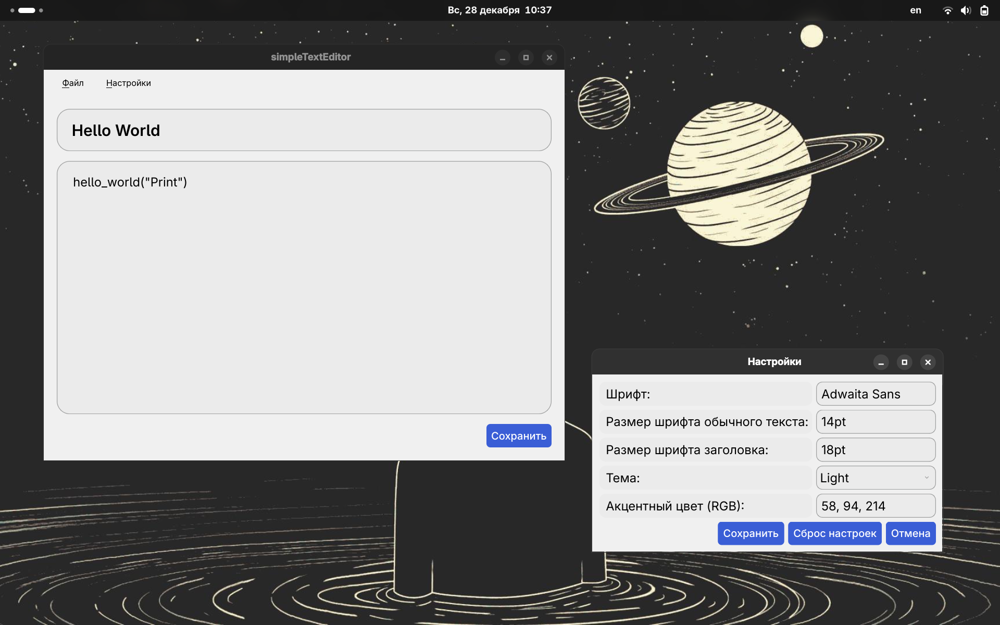
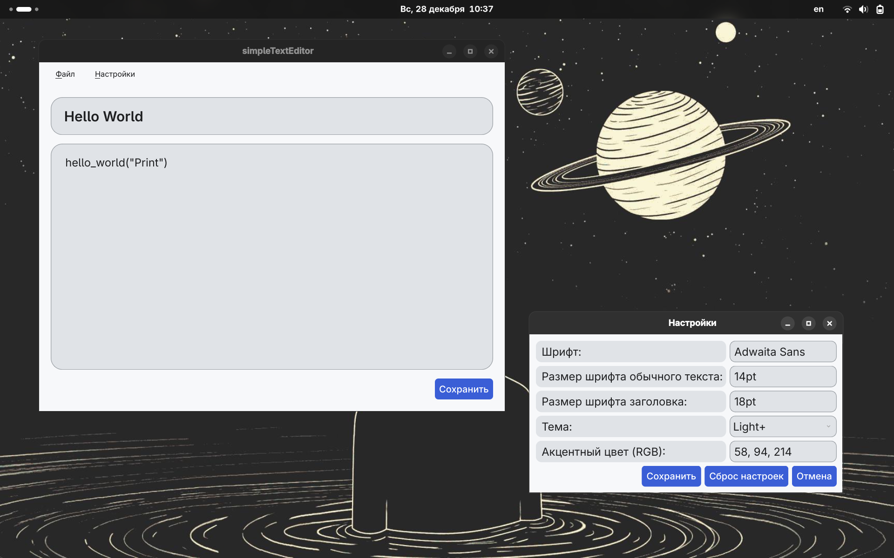

# simpleTextEditor


**simpleTextEditor** — это кроссплатформенный редактор текстовых файлов (`.txt`), написанный на Python с использованием библиотеки **PyQt6**.

Программа имеет простой интерфейс и минималистичный дизайн. Она поддерживает изменение шрифта, темы и некоторых других параметров интерфейса.

---

## ✨ Возможности

- Открытие и сохранение текстовых файлов (`.txt`)
- Поддержка светлой и тёмной темы интерфейса
- Удобный и минималистичный интерфейс
- Сохранение пользовательских настроек
- Кроссплатформенность: Windows / Linux / macOS

---

## 🔍 Превью интерфейса

| Тема          | Windows      | Linux                                         |
|---------------|--------------|-----------------------------------------------|
| Dark          |              |    |
| Dark+         |              |  |
| Gruvbox Dark  |              |  |
| Gruvbox Light |              |  |
| Light         |              |  |
| Light+        |              |         |
---

## 🛠 Используемые технологии

| Компонент | Описание |
|-----------|----------|
| **Python 3.10+** | Основной язык разработки |
| **PyQt6** | Библиотека для создания графического интерфейса |

---

## 🚀 Установка и запуск

### 1-й способ - готовые версии

> ⚠️ В приложениях версий v.1.0.0 и v.1.0.1 отсутствуют функции кастомизации интерфейса.
1. Установите шрифт [Adwaita Sans](https://gitlab.gnome.org/GNOME/adwaita-fonts).
2. Перейдите на вкладку Releases.
3. Скачайте .zip-архив для вашей ОС (Windows или Linux) и распакуйте его в любом удобном для Вас месте.
4. Запустите исполняемый файл программы (simpleTextEditor.exe - для Windows, simpleTextEditor - для Linux).

### 2-й способ — запуск из исходников

> ℹ️ Если Вы установили программу следующим способом, то для обновления приложения Вы можете выполнить следующие команды: 
> ```bash
> cd simpleTextEditor
> git pull
> ```
а) Для всех ОС
1. Установите:
   - [Python](https://www.python.org)
   - [Git](https://git-scm.com/downloads)
   - Шрифт [Adwaita Sans](https://gitlab.gnome.org/GNOME/adwaita-fonts)
2. Клонируйте репозиторий:
   ```bash
   git clone https://github.com/Cheboxxxarik/simpleTextEditor
   cd simpleTextEditor
   ```
3. Создайте виртуальное окружение: 
   ```bash
   python -m venv .venv
   ```
4. Активируйте виртуальное окружение:  
   **На Windows**: 
   ```powershell
   .venv/Scripts/activate
   ``` 
   > ℹ️ Если появляется ошибка, откройте PowerShell от администратора и выполните:
   > ```powershell
   > Set-ExecutionPolicy Bypass
   > ```
   **На Linux/MacOS**: 
   ```bash
   source .venv/bin/activate
   ```
5. Установите библиотеку PyQt6:
   ```bash
   pip install pyqt6
   # или
   pip3 install pyqt6
   ```
6. Запустите приложение:  
   ```bash
   python main.py
   # или
   python3 main.py
   ```
б) Для Linux и MacOS
1. Установите: 
   - [Git](https://git-scm.com/downloads)
   - шрифт [Adwaita Sans](https://gitlab.gnome.org/GNOME/adwaita-fonts)
2. Клонируйте репозиторий: 
   ```bash
   git clone https://github.com/Cheboxxxarik/simpleTextEditor
   cd simpleTextEditor
   ```
3. Запустите bash-скрипт install_dependencies.sh для установки зависимостей.
   ```bash
   bash install_dependencies.sh
   # или
   ./install_dependencies.sh
   ```
4. Запустите приложение:
   ```bash
   bash main.sh
   # или
   ./main.sh
   ```

---

## 👨‍💻 Для разработчиков

### Установка для разработки
```bash
# Клонирование репозитория
git clone https://github.com/Cheboxxxarik/simpleTextEditor
cd simpleTextEditor
# Переключение на ветку для разработки новых функций
git checkout new_features
```
Про установку зависимостей уже было рассказано [здесь](#2-й-способ--запуск-из-исходников).

### Создание тем
При создании тем вы должны следовать этому шаблону:
```json
{
    "window_color": "#1e1e1e",
    "window_text_color": "#dcdcdc",       

    "text_color": "#dcdcdc",
    "background_color": "#333637",

    "border_color": "#9fa0a0",

    "button_text_color": "#ffffff",
    "highlighted_text_color": "#ffffff",

    "placeholder_color": "#9a9a9a",
    
    "disabled_window_color": "#646464",
    "disabled_text_color": "#646464",
    "disabled_highlight_color": "#3c3c3c",
    "disabled_highlighted_text_color": "#646464"
}
```

| Параметр | Описание |
| -------- | -------- |
| `window_color` | Цвет окна и элементов меню |
| `window_text_color` | Цвет текста на фоне окон |
| `text_color` | Цвет текста в полях для ввода |
| `background_color` | Цвет на фоне текстовых полей |
| `border_color` | Цвет рамок текстовых полей |
| `button_text_color`  | Цвет текста элементов меню (а также кнопок, если что-то случится со их стилем) |
| `highlighted_text_color` | Цвет выделенного текста |
| `placeholder_color` | Цвет подсказок в текстовых полях (плейсхолдеров) |
| `disabled_window_color` | Цвет фона отключенных окон
| `disabled_text_color`	| Цвет текста в отключенном состоянии
| `disabled_highlight_color` | Цвет выделения в отключенном состоянии
| `disabled_highlighted_text_color` | Цвет выделенного текста в отключенном состоянии |

**Рекомендации по созданию тем:**

1. Контрастность: Убедитесь, что `text_color` и `background_color` имеют достаточный контраст
2. Согласованность: Цвета должны гармонировать между собой
3. Тестирование: Протестируйте тему во всех состояниях (активное, отключенное, выделенное)

**Формат файла темы:**
- Сохраняйте тему в файл с расширением `.json`
- Название файла должно соответствовать названию темы (например, `Dark.json`)
- Все значения цветов должны быть в HEX-формате (#RRGGBB)
- Файлы тем размещайте в директории `themes/`
- Тема должна содержать все параметры, перечисленные [выше](#создание-тем), для стабильной работы программы