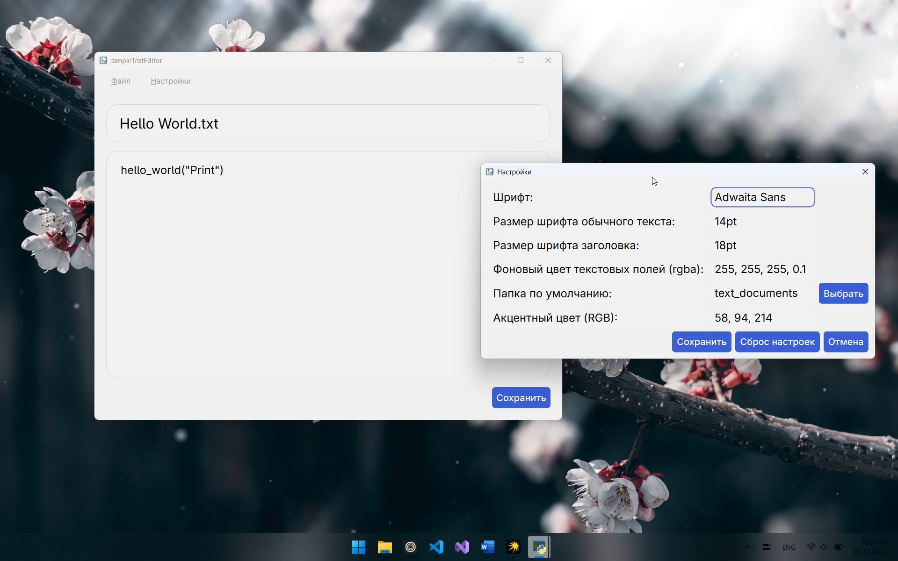
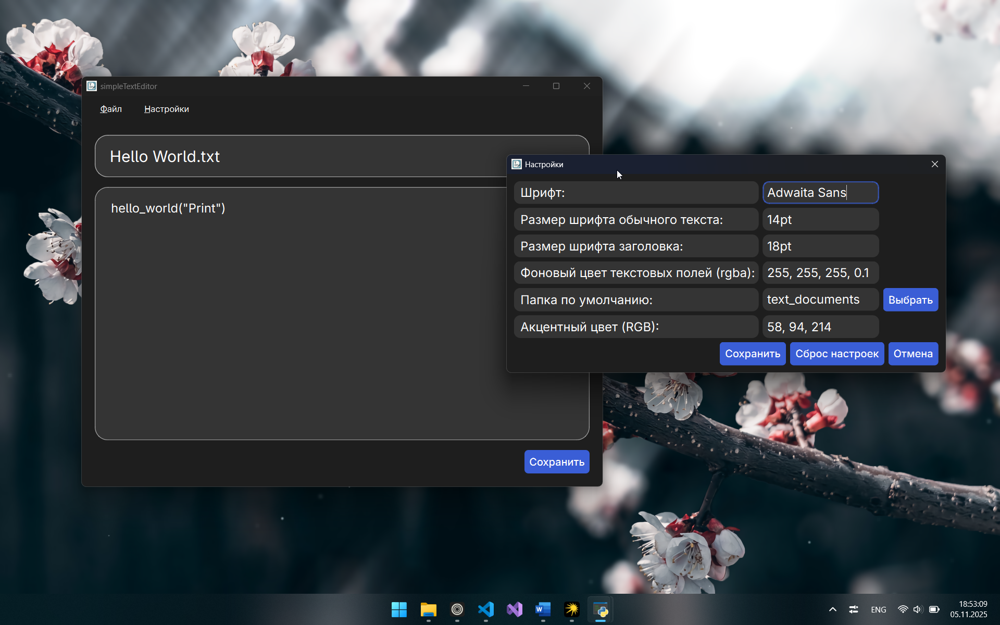

# simpleTextEditor


**simpleTextEditor** — это кроссплатформенный редактор текстовых файлов (`.txt`), написанный на Python с использованием библиотеки **PyQt6**.

Программа имеет простой интерфейс и минималистичный дизайн. Поддерживает изменение шрифта и некоторых параметров интерфейса (кроме готовых версий для Windows и Linux).

---

## ✨ Возможности

- Открытие и сохранение текстовых файлов (`.txt`)
- Поддержка светлой и тёмной темы интерфейса
- Удобный и минималистичный интерфейс
- Сохранение пользовательских настроек через `config.py`
- Кроссплатформенность: Windows / Linux / macOS

---

## 🔍 Превью интерфейса

| Светлая тема | Тёмная тема |
|-------------|-------------|
|  |  |

## 🛠 Используемые технологии

| Компонент | Описание |
|-----------|----------|
| **Python 3.10+** | Основной язык разработки |
| **PyQt6** | Библиотека для создания графического интерфейса |

---

## 🚀 Установка и запуск

### Способ 1 — запуск из исходников

1. Установите:
   - [Python](https://www.python.org)
   - [Git](https://git-scm.com/downloads)
   - Шрифт [Adwaita Sans](https://gitlab.gnome.org/GNOME/adwaita-fonts)
2. Склонируйте репозиторий:
   ```bash
   git clone https://github.com/Cheboxxxarik/simpleTextEditor
   cd simpleTextEditor
   ```
3. Создайте виртуальное окружение: 
   ```bash
   python -m venv .venv
   ```
4. Активируйте виртуальное окружение:  
   **На Windows**: 
   ```powershell
   .venv/Scripts/activate
   ``` 
   > ℹ️ Если появляется ошибка, откройте PowerShell от администратора и выполните:
   > ```powershell
   > Set-ExecutionPolicy Bypass
   > ```
   **На Linux/MacOS**: 
   ```bash
   source .venv/bin/activate
   ```
5. Установите библиотеку PyQt6:
   ```bash
   pip install pyqt6
   # или
   pip3 install pyqt6
   ```
6. Запустите приложение:  
   ```bash
   python main.py
   # или
   python3 main.py
   ```
### 2-й способ - готовые версии
>⚠️ В готовых версиях отключены функции кастомизации интерфейса.
#### 1) Для Windows 
1. Установите шрифт [Adwaita Sans](https://gitlab.gnome.org/GNOME/adwaita-fonts)
2. Перейдите на вкладку Releases
3. Скачайте .zip-архив "simpleTextEditor-v.1.0.0-Windows-minimal_app.zip" и распакуйте его в любом удобном для Вас месте
4. Откройте папку dist.
5. Запустите файл simpleTextEditor.exe.
#### 2) Для Linux
1. Установите шрифт [Adwaita Sans](https://gitlab.gnome.org/GNOME/adwaita-fonts)
2. Перейдите на вкладку Releases
3. Скачайте .zip-архив "simpleTextEditor-v.1.0.0-Linux-minimal_app.zip" и распакуйте его в любом удобном для Вас месте
4. Запустите файл main.
### 3-й способ - Для Linux и MacOS
1. Установите: 
   - [Git](https://git-scm.com/downloads)
   - шрифт [Adwaita Sans](https://gitlab.gnome.org/GNOME/adwaita-fonts)
2. Склонируйте репозиторий: 
   ```bash
   git clone https://github.com/Cheboxxxarik/simpleTextEditor
   cd simpleTextEditor
   ```
3. Запустите bash-скрипт install_packages.sh для установки зависимостей.
   ```bash
   bash install_packages.sh
   # или
   ./install_packages.sh
   ```
4. Запустите приложение:
   ```bash
   bash main
   # или
   ./main
   ```
