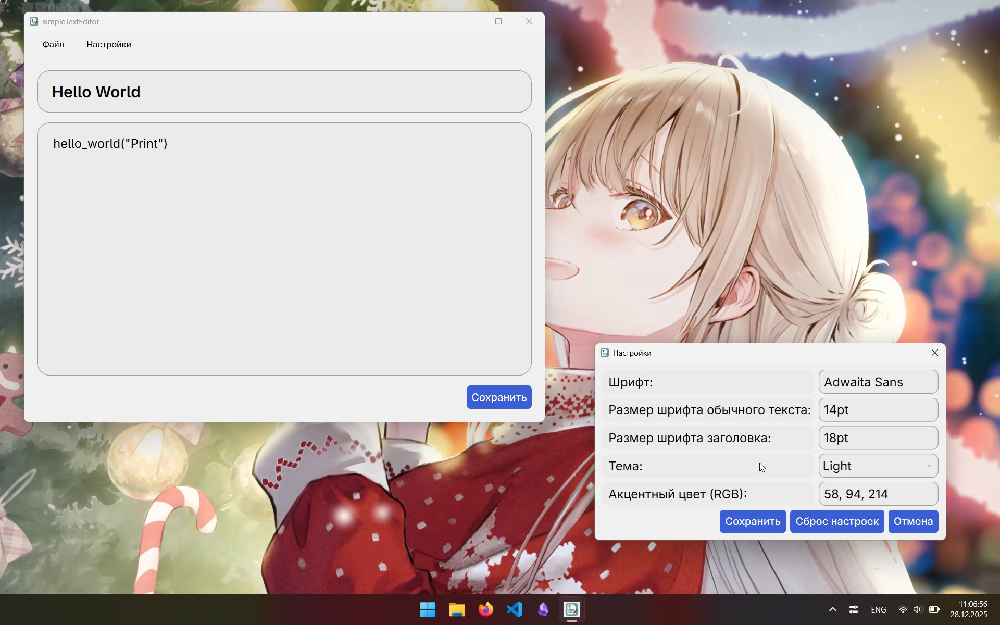
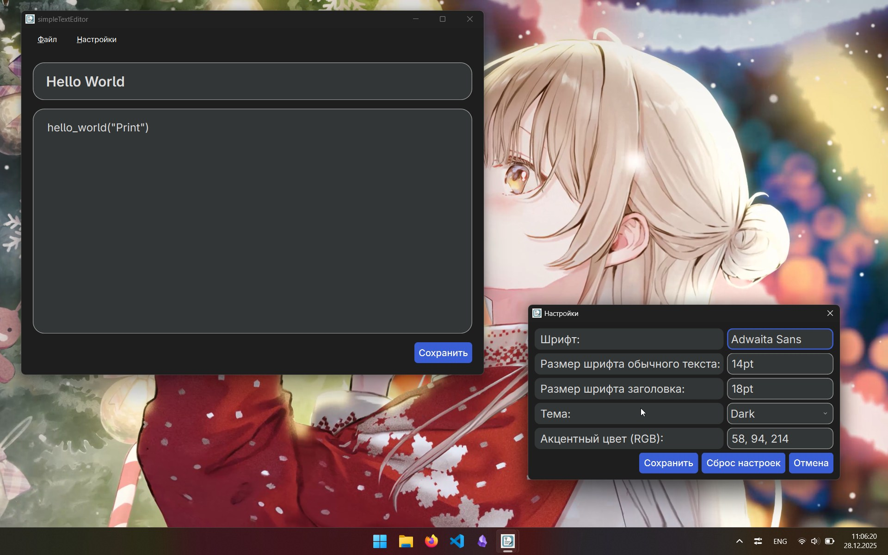
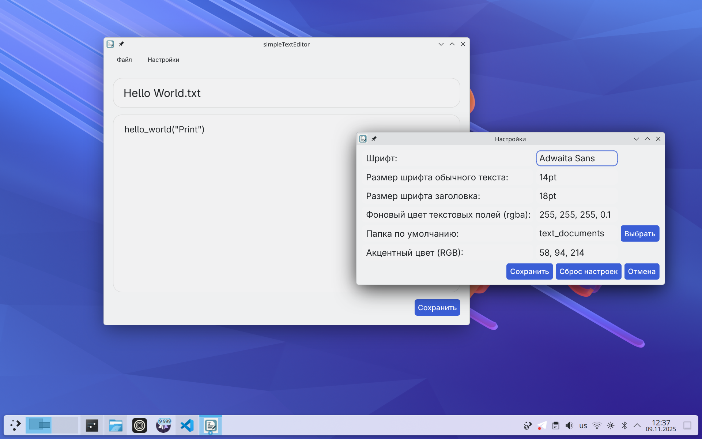
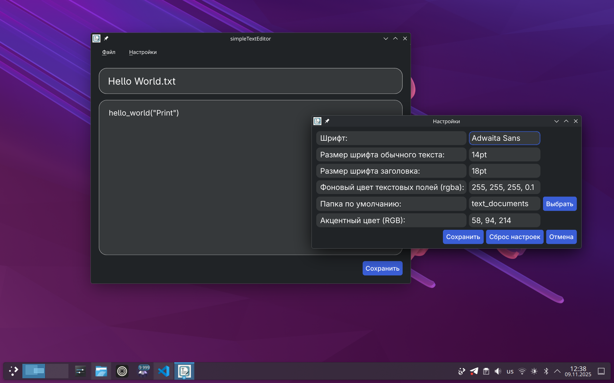

# simpleTextEditor


**simpleTextEditor** — это кроссплатформенный редактор текстовых файлов (`.txt`), написанный на Python с использованием библиотеки **PyQt6**.

Программа имеет простой интерфейс и минималистичный дизайн. Она поддерживает изменение шрифта, темы и некоторых других параметров интерфейса.

---

## ✨ Возможности

- Открытие и сохранение текстовых файлов (`.txt`)
- Поддержка светлой и тёмной темы интерфейса
- Удобный и минималистичный интерфейс
- Сохранение пользовательских настроек
- Кроссплатформенность: Windows / Linux / macOS

---

## 🔍 Превью интерфейса

|          | Светлая тема | Тёмная тема |
|----------|--------------|-------------|
| Windows  |  |  |
| Linux    |  |  |

---

## 🛠 Используемые технологии

| Компонент | Описание |
|-----------|----------|
| **Python 3.10+** | Основной язык разработки |
| **PyQt6** | Библиотека для создания графического интерфейса |

---

## 🚀 Установка и запуск

### 1-й способ - готовые версии

>⚠️ В приложениях версий v.1.0.0 и v.1.0.1 отсутствуют функции кастомизации интерфейса.
1. Установите шрифт [Adwaita Sans](https://gitlab.gnome.org/GNOME/adwaita-fonts).
2. Перейдите на вкладку Releases.
3. Скачайте .zip-архив для вашей ОС (Windows или Linux) и распакуйте его в любом удобном для Вас месте.
4. Запустите исполняемый файл программы (simpleTextEditor.exe - для Windows, simpleTextEditor - для Linux).

### 2-й способ — запуск из исходников
> ℹ️ Если Вы установили программу следующим способом, то для обновления приложения Вы можете выполнить следующие команды: 
> ```bash
> cd simpleTextEditor
> git pull
> ```
а) Для всех ОС
1. Установите:
   - [Python](https://www.python.org)
   - [Git](https://git-scm.com/downloads)
   - Шрифт [Adwaita Sans](https://gitlab.gnome.org/GNOME/adwaita-fonts)
2. Клонируйте репозиторий:
   ```bash
   git clone https://github.com/Cheboxxxarik/simpleTextEditor
   cd simpleTextEditor
   ```
3. Создайте виртуальное окружение: 
   ```bash
   python -m venv .venv
   ```
4. Активируйте виртуальное окружение:  
   **На Windows**: 
   ```powershell
   .venv/Scripts/activate
   ``` 
   > ℹ️ Если появляется ошибка, откройте PowerShell от администратора и выполните:
   > ```powershell
   > Set-ExecutionPolicy Bypass
   > ```
   **На Linux/MacOS**: 
   ```bash
   source .venv/bin/activate
   ```
5. Установите библиотеку PyQt6:
   ```bash
   pip install pyqt6
   # или
   pip3 install pyqt6
   ```
6. Запустите приложение:  
   ```bash
   python main.py
   # или
   python3 main.py
   ```
б) Для Linux и MacOS
1. Установите: 
   - [Git](https://git-scm.com/downloads)
   - шрифт [Adwaita Sans](https://gitlab.gnome.org/GNOME/adwaita-fonts)
2. Клонируйте репозиторий: 
   ```bash
   git clone https://github.com/Cheboxxxarik/simpleTextEditor
   cd simpleTextEditor
   ```
3. Запустите bash-скрипт install_dependencies.sh для установки зависимостей.
   ```bash
   bash install_dependencies.sh
   # или
   ./install_dependencies.sh
   ```
4. Запустите приложение:
   ```bash
   bash main.sh
   # или
   ./main.sh
   ```